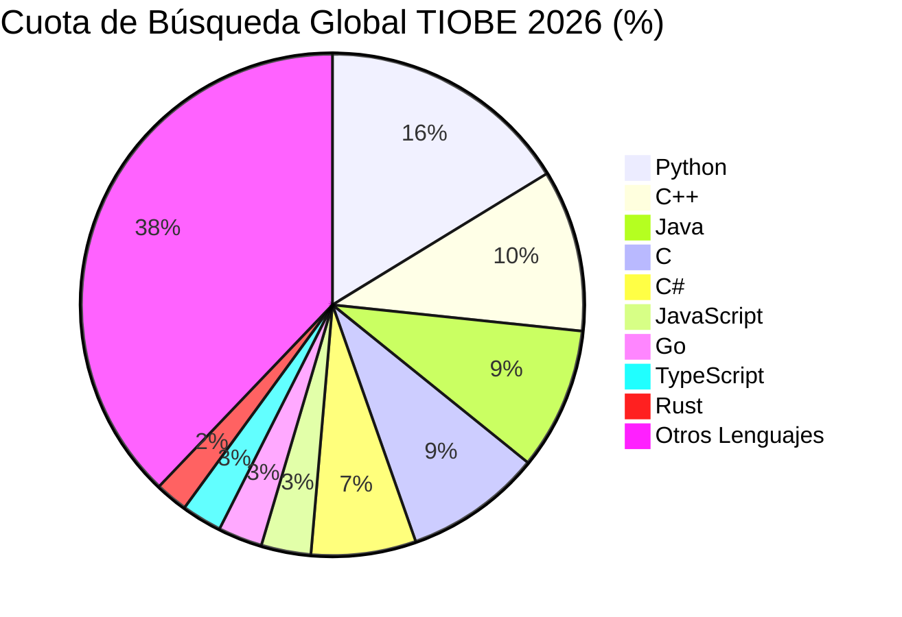
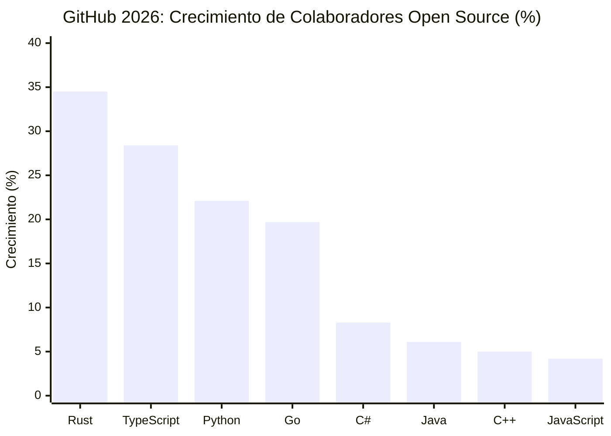
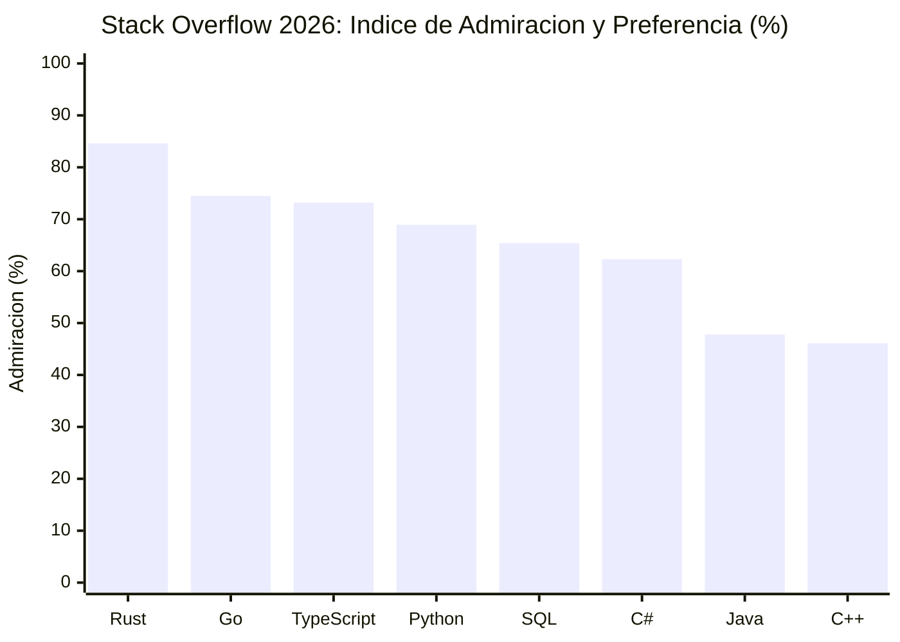
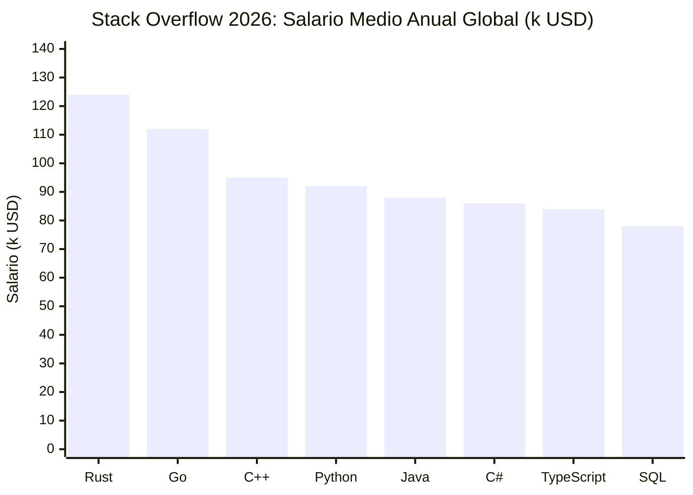

> **Resumen en Lenguaje Sencillo**
> * **Python se mantiene en la cima:** Python lidera con una cuota de mercado del 16.25% en el índice TIOBE, conservando el puesto número uno como la interfaz universal para machine learning y análisis de datos.
> * **TypeScript supera a JavaScript en colaboradores activos:** En GitHub, TypeScript ha superado a JavaScript con un crecimiento del +28.4% anual en colaboradores de código abierto, ya que el desarrollo asistido por IA exige tipado estricto.
> * **Rust y Go lideran la infraestructura moderna:** Go es el estándar indiscutible para microservicios cloud de alto rendimiento, mientras que Rust encabeza la satisfacción de desarrolladores con un 84.6% y los salarios más altos.
> * **El software de pago retrocede:** Entornos con licencias caras como MATLAB han salido del top 20 por primera vez en más de diez años (-3.8% interanual), reemplazados por soluciones abiertas como Python y Julia.

Elegir qué lenguaje de programación aprender o utilizar en producción puede resultar abrumador. Con cientos de lenguajes disponibles, actualizaciones constantes de frameworks y asistentes de IA cambiando el trabajo diario, muchos desarrolladores se preguntan: *¿cuáles son los lenguajes que dominan realmente en 2026?*

Al analizar las estadísticas reales del índice TIOBE, los datos de colaboradores en GitHub Octoverse y las encuestas de Stack Overflow, podemos ver claramente hacia dónde avanza la industria.

---

## 1. Índice TIOBE 2026: Cuota de mercado en búsquedas globales

El índice TIOBE mide el volumen de búsqueda global, número de ingenieros capacitados, cursos y soporte de terceros para calcular la cuota de mercado de cada lenguaje.

| Puesto 2026 | Lenguaje | Cuota de Mercado (%) | Cambio Interanual | Sector Principal en 2026 |
| --- | --- | --- | --- | --- |
| **1** | **Python** | 16.25% | +1.85% | Investigación en IA, machine learning, automatización |
| **2** | **C++** | 10.42% | +0.78% | Motores de videojuegos, robótica, finanzas de baja latencia |
| **3** | **Java** | 9.15% | -0.65% | Banca corporativa, Android, hilos virtuales |
| **4** | **C** | 8.80% | -1.10% | Firmware embebido, microcontroladores, kernels de SO |
| **5** | **C#** | 6.75% | +0.45% | Software empresarial, juegos en Unity, nube .NET |
| **6** | **JavaScript** | 3.20% | -0.40% | Frontend web, scripts de navegador, ecosistema web |
| **7** | **Go (Golang)** | 2.85% | +0.95% | Microservicios en la nube, herramientas de Kubernetes |
| **8** | **TypeScript** | 2.60% | +1.15% | Desarrollo web full-stack, aplicaciones escalables |
| **9** | **Rust** | 2.10% | +0.80% | Programación de sistemas segura, motores de inferencia |
| **10** | **SQL** | 1.95% | +0.20% | Consultas de bases de datos relacionales |

**Conclusión clave:** Python, C++ y Java concentran más del 35% del índice global, demostrando que los pilares consolidados siguen firmes mientras lenguajes modernos como TypeScript, Go y Rust registran los mayores porcentajes de crecimiento.

---

## 2. GitHub Octoverse 2026: Crecimiento de colaboradores en código abierto

Mientras las búsquedas miden el interés general, las métricas de GitHub reflejan el código que los programadores construyen a diario en proyectos reales.

**Conclusión clave:** El incremento del +28.4% en TypeScript y del +34.5% en Rust confirma la preferencia de la industria por bases de código con tipado estricto y comprobación en tiempo de compilación para evitar fallos en producción.

---

## 3. Encuesta Stack Overflow 2026: Satisfacción y salarios globales

La diferencia entre lo que los desarrolladores usan por obligación y lo que realmente disfrutan usar indica las tecnologías que dominarán en los próximos años.

**Conclusión clave:** Rust lidera la satisfacción de los programadores con un 84.6% y el salario medio global más alto ($124,000), seguido de cerca por Go ($112,000), demostrando el alto valor que las empresas otorgan a la eficiencia de infraestructura.

---

## 4. Distribución del trabajo por sector de la industria

Cada área en 2026 requiere herramientas específicas. Así se distribuye el uso de lenguajes en los principales campos de la ingeniería:

| Campo de la Ingeniería | Estándar Principal | Secundario o en Crecimiento | Por Qué Domina Esta Combinación |
| --- | --- | --- | --- |
| **IA y Machine Learning** | Python | C++, Rust, Mojo | Python ofrece la interfaz clara; C++ y CUDA procesan el cálculo pesado |
| **Desarrollo Web de Producto** | TypeScript | Python, Go | TypeScript gestiona el frontend; Go o Python alimentan las APIs |
| **Cloud y DevOps** | Go | Python, Rust | Go genera binarios compactos con inicio en milisegundos |
| **Sistemas y Videojuegos** | C++, C | Rust, Zig | Control directo del hardware sin pausas de recolección de basura |
| **Banca y Gran Empresa** | Java, C# | Go, TypeScript | Alto rendimiento transaccional, normativas maduras y soporte a largo plazo |

---

## 5. Consejos prácticos para desarrolladores en 2026

1. **Elige según el área de trabajo, no por tendencias en redes:** Para desarrollo web, TypeScript es indispensable. Para machine learning, Python es fundamental. Para infraestructura y microservicios escalables, Go y Rust son la referencia.
2. **El tipado estricto es el estándar:** El uso de asistentes de IA ha impulsado la adopción de TypeScript y Rust. Los tipos claros actúan como guías para que la IA genere código preciso y evite errores.
3. **El perfil en forma de T:** Domina a fondo un lenguaje principal de productividad (como TypeScript o Python) y adquiere conocimientos operativos en un lenguaje de alto rendimiento (como Go o Rust).
4. **Los fundamentos superan a la sintaxis:** La gestión de memoria, los modelos de concurrencia, las redes y el diseño de software limpio se mantienen constantes sin importar el lenguaje que escribas.
